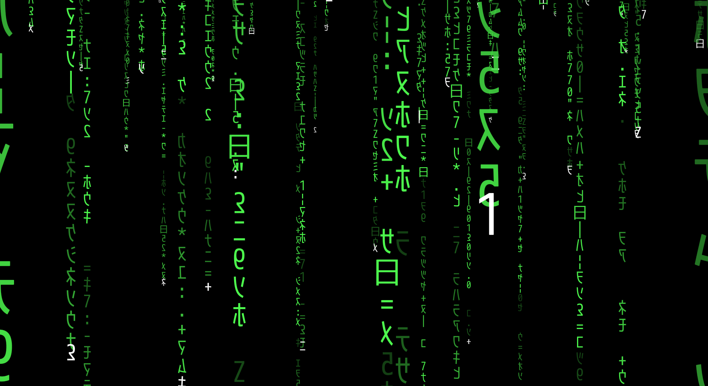
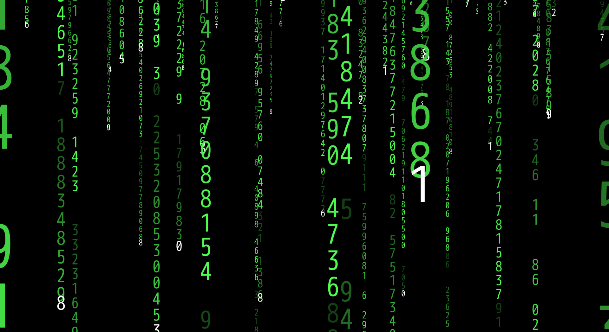
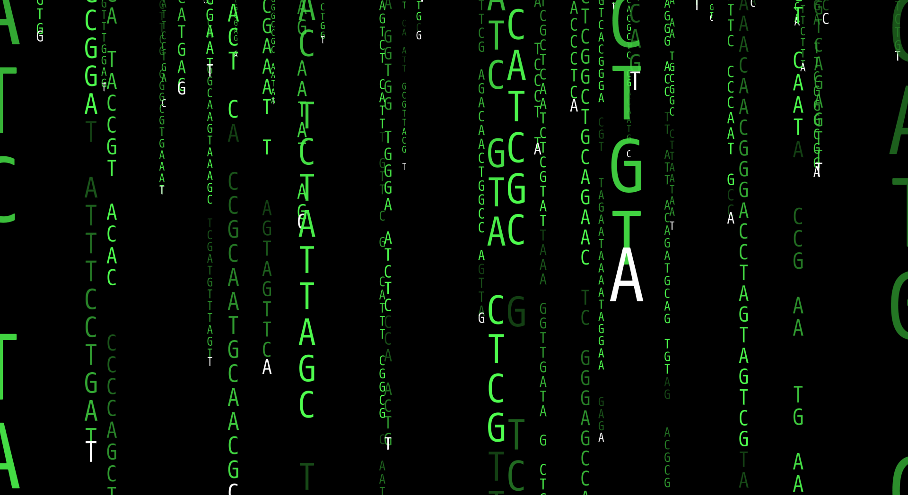
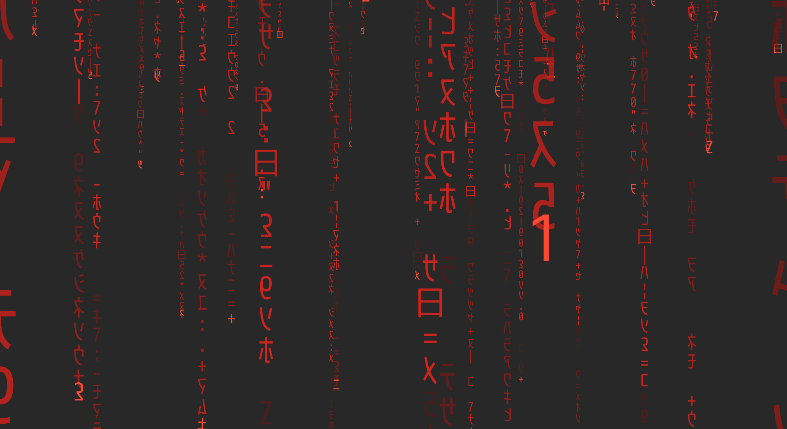

# Description

A rewrite of `glmatrix` from `xscreensaver` with [distance
field](https://www.google.com/search?q=distance+field+font+rendering)
font rendering and color customizations.

It renders to X server root window, and may be used as a live desktop
wallpaper in window managers like DWM.

As original `glmatrix` it has the following modes: matrix, binary,
decimal, DNA, hexadecimal:









Colors may be customized:





# Dependencies

## Build

You will need the following at build time:

  * CMake
  * C++17 compiler
  * libX11
  * GLEW
  * Python3 with Python Imaging Library

In Debian the dependencies may be installed from the following
packages:

```
cmake g++ libglew-dev libx11-dev python3-pil
```

## Runtime

Support of modern OpenGL (version 3.0 or higher) is required in
graphics hardware and drivers.
